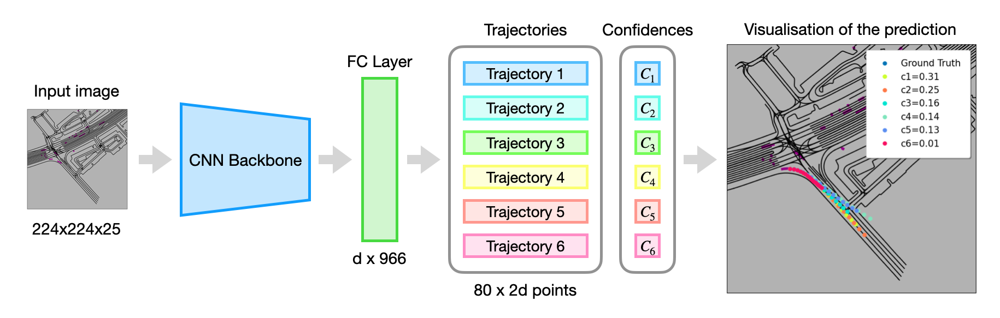

# Waymo motion prediction challenge 2021: 3rd place solution



- 📜[**Technical report**](./docs/CVPR2021_Waymo_motion_prediction.pdf)   
- 🗨️[Presentation](./docs/waymo_motion_prediction_2021_3rd_place_solution_presentation.pdf)  
- 🎉[Announcement](https://youtu.be/eOL_rCK59ZI?t=6485)    
- 🛆[Motion Prediction Channel Website](https://waymo.com/open/challenges/2021/motion-prediction/)  
- 🛆[CVPR2021 workshop](http://cvpr2021.wad.vision/)  


## Team behind this solution:
1. Artsiom Sanakoyeu [[Homepage](https://gdude.de)] [[Twitter](https://twitter.com/artsiom_s)] [[Telegram Channel](https://t.me/gradientdude)] [[LinkedIn](https://www.linkedin.com/in/sanakoev)]
2. Stepan Konev [[LinkedIn]](https://www.linkedin.com/in/stepan-konev/)
3. Kirill Brodt [[GitHub]](https://github.com/kbrodt)

## Dataset

Download
[datasets](https://console.cloud.google.com/storage/browser/waymo_open_dataset_motion_v_1_0_0)
`uncompressed/tf_example/{training,validation,testing}`

## Prerender

Change paths to input dataset and output folders

```bash
python prerender.py \
    --data /home/data/waymo/training \
    --out ./train
    
python prerender.py \
    --data /home/data/waymo/validation \
    --out ./dev \
    --use-vectorize \
    --n-shards 1
    
python prerender.py \
    --data /home/data/waymo/testing \
    --out ./test \
    --use-vectorize \
    --n-shards 1
```

## Training

```bash
MODEL_NAME=xception71
python train.py \
    --train-data ./train \
    --dev-data ./dev \
    --save ./${MODEL_NAME} \
    --model ${MODEL_NAME} \
    --img-res 224 \
    --in-channels 25 \
    --time-limit 80 \
    --n-traj 6 \
    --lr 0.001 \
    --batch-size 48 \
    --n-epochs 120
```

## Submit

```bash
python submit.py \
    --test-data ./test/ \
    --model-path ${MODEL_PATH_TO_JIT} \
    --save ${SAVE}
```


## Visualize predictions

```bash
python visualize.py \
    --model ${MODEL_PATH_TO_JIT} \
    --data ${DATA_PATH} \
    --save ./viz
```

## Citation
If you find our work useful, please cite it as:
```
@article{konev2021motioncnn,
  title={MotionCNN: A Strong Baseline for Motion Prediction in Autonomous Driving},
  author={Konev, Stepan and Brodt, Kirill and Sanakoyeu, Artsiom},
  year={2021}
}
```

## Related repos

* [Kaggle Lyft motion prediciton 3rd place solution](https://gdude.de/blog/2021-02-05/Kaggle-Lyft-solution)
